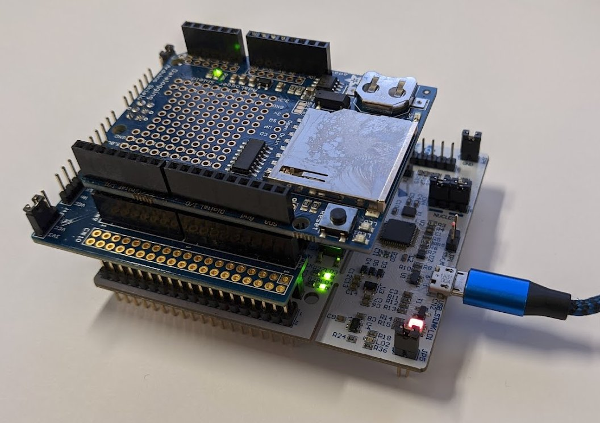
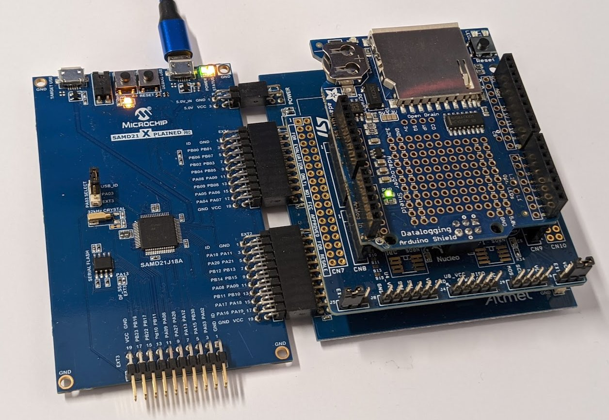
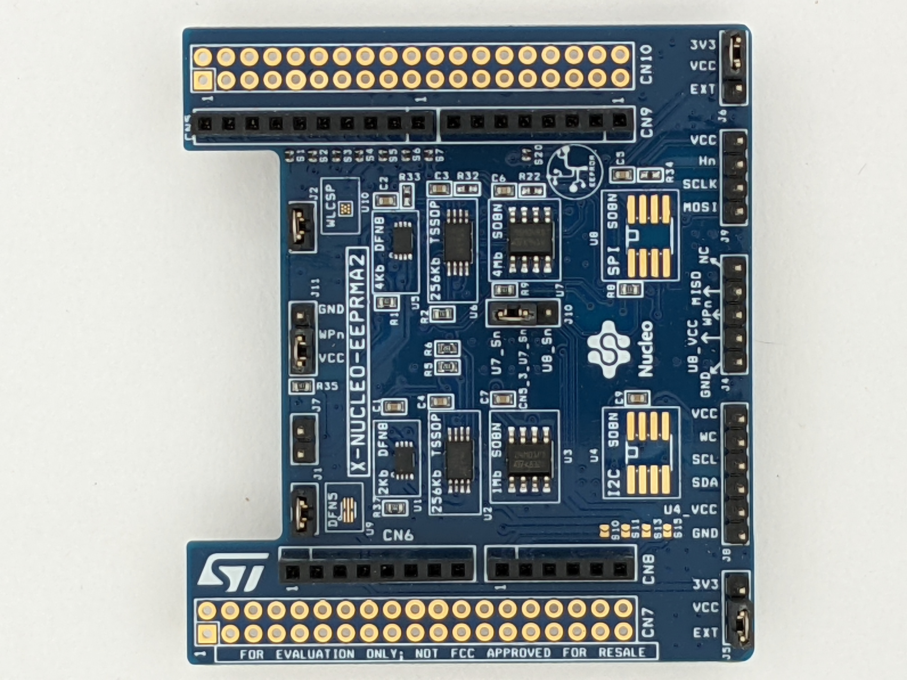
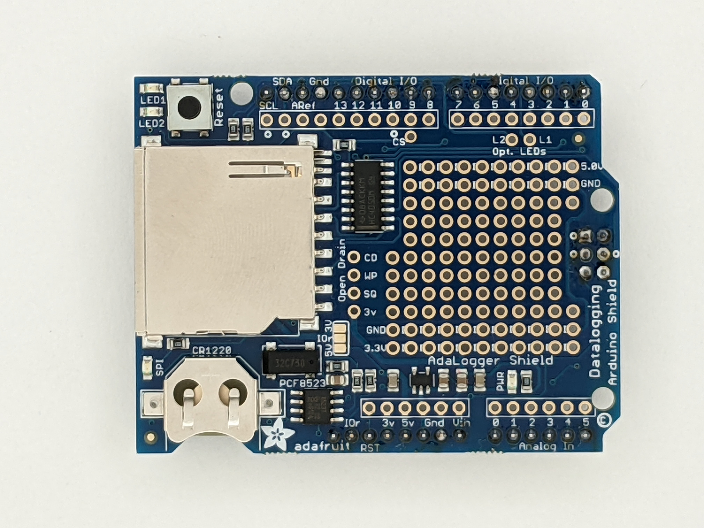
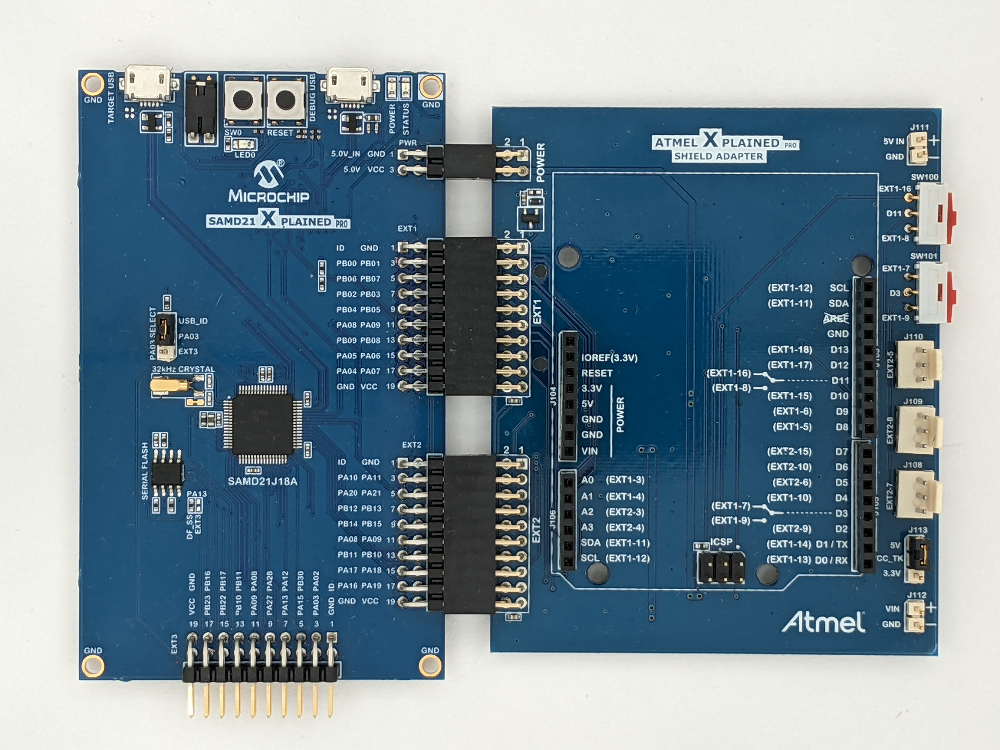

# libnklabs-examples

This repository holds an example application for
[libnklabs](https://github.com/nklabs/libnklabs) that runs on various STM32
and ATSAM development boards.

# Example Application

The source code for an example application is available in [app/](app/).

It can be compiled for various targets, see [target/](target/).

To build a particular example and install it on a target board:

	cd target/nucleo-g071rb
	make
	make flash

It is important to work with and not replace the vendor tools and libraries
in commercial products.  The example uses each vendor's tool generated HAL
(hardware abtraction layer) and Makefile.  In particular:

* STM32CubeMX allows you to instantiate peripherals, define the pinouts, set up clocking and generate startup code for ST Mirco's MCUs.

* Atmel Start is a web tool that does the same for Microchip/Atmel's ATSAM ARM microcontrollers.

These tools do have a learning curve that we believe is worth overcoming. 
The example application provided here can be a good starting point for this.

It is important to note that these tools are not IDEs.  They can target
IDEs, but they also can generate code that can be built from the command
line using Make and Gcc.  We prefer this since it facilitates automated
testing and building.

Once the application is running, the follow commands are available:

[Example application commands](doc/app.md)

## Arduino interface

The example application includes CLI commands that allow you to access
common embedded system peripherals including I2C EEPROMs, SPI-Flash devices
and an external Real Time Clock.  The low cost vendor development boards do
not include these peripherals, so the example application accesses them on
the following Arduino "shield" boards that can be plugged into the MCU
vendor's development boards:

The example application will work without these shields, you just lose the
associated features.

Shields plugged into ST Nucleo board:

ST Nucleo Nano board plugged into Nano adapter, then plugged into shields:

Shields plugged into ATARDADPT-XPRO for Atmel Xplained Pro board:

For I2C and SPI EEPROMs:

[X-NUCLEO-EEPRMA2](https://www.st.com/en/evaluation-tools/x-nucleo-eeprma2.html)

For the PCF8523 Real Time Clock:

[Adalogger Shield](https://learn.adafruit.com/adafruit-data-logger-shield)

You need a recent version of this board- one that supports 3.3v.

For Atmel/Microchip's Xplained Pro development boards, you need this Arduino
Shield adapter to use the above boards:

[ATARDADPT-XPRO](https://www.microchip.com/en-us/development-tool/ATARDADPT-XPRO)

